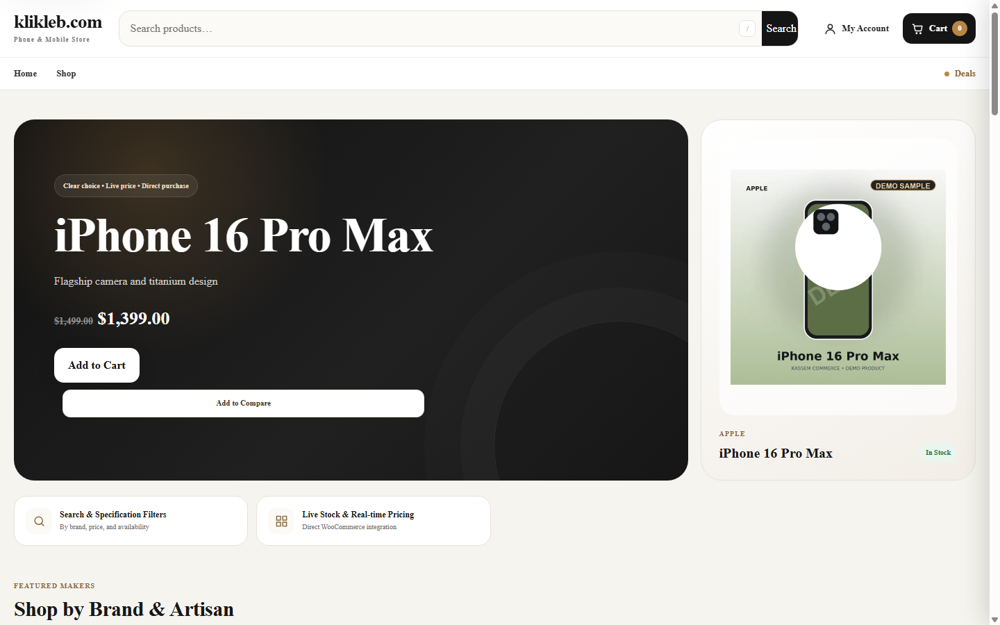
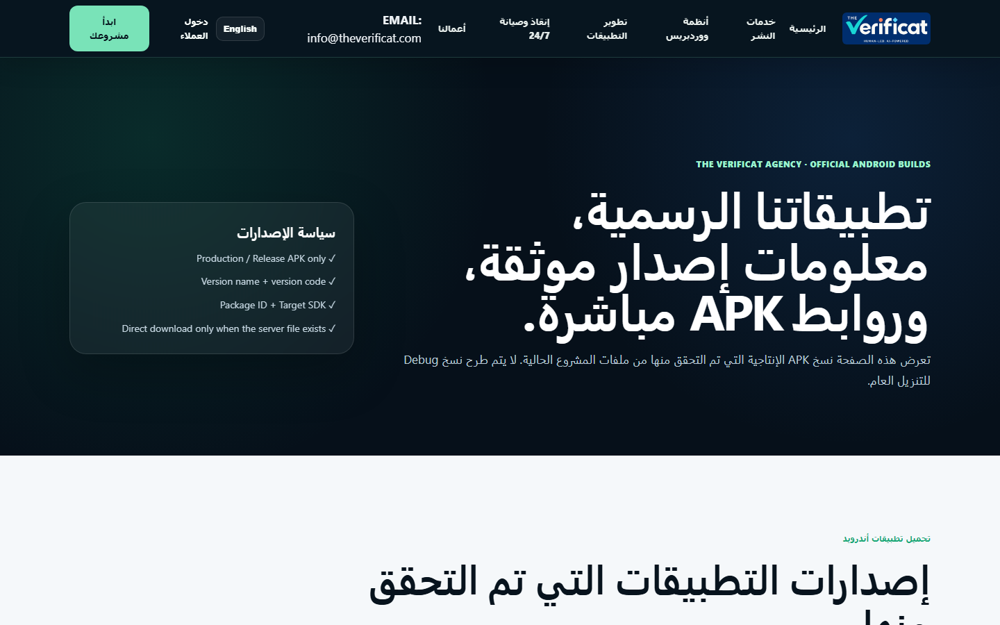

# Mohamad Kassem

WordPress & Android developer focused on digital publishing, automation, API integrations, media platforms, and production-grade content systems.

## Selected projects

### KASSEM Theme — BeirutTime

### Kassem Commerce — KlikLeb

### Android applications

## Products
- [KASSEM Theme](https://github.com/fortyspring/kassem-theme)
- [Kassem Commerce](https://github.com/fortyspring/kassem-commerce)
- [BeirutTime App](https://github.com/fortyspring/beiruttime-app)
- [Ya Lebanon App](https://github.com/fortyspring/yalebnan-app)
- [The Verificat App](https://github.com/fortyspring/theverificat-app)
- [Qassem SEO Pro](https://github.com/fortyspring/qassem-seo-pro)
- [WP Multi Publisher](https://github.com/fortyspring/wp-multi-publisher)

## Official links
- BeirutTime: https://beiruttime-lb.com/
- The Verificat Agency: https://theverificat.com/
- Ya Lebanon: https://yalebnan.org/
- KlikLeb: https://klikleb.com/

## Source code policy
Commercial and production source code is maintained in private repositories. Public repositories are product showcases and documentation only.

© 2026 Mohamad Kassem. All rights reserved.